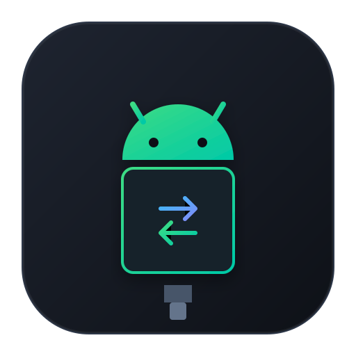
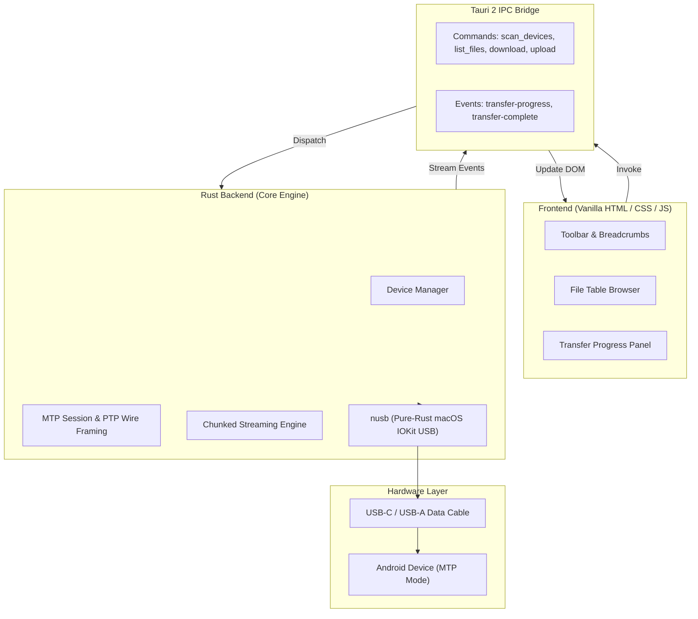

<p align="center">
  
</p>

<h1 align="center">DroidBridge</h1>

<p align="center">
  <strong>Universal Android-to-macOS file transfer over USB.</strong><br>
  No Wi-Fi. No Bluetooth. No Cloud. No Ads. Pure Rust and native speed.
</p>

<p align="center">
  <a href="https://github.com/mahendrapratap23/droidbridge/releases/latest">
    
  </a>
  <a href="https://github.com/mahendrapratap23/droidbridge/releases">
    
  </a>
  <a href="https://v2.tauri.app/">
    
  </a>
  <a href="https://www.rust-lang.org/">
    
  </a>
  <a href="LICENSE">
    
  </a>
</p>

<p align="center">
  <a href="#-quick-download"><strong>Quick Download</strong></a> •
  <a href="#-why-droidbridge"><strong>Why DroidBridge?</strong></a> •
  <a href="#-features"><strong>Features</strong></a> •
  <a href="#-device-compatibility"><strong>Compatibility</strong></a> •
  <a href="#-architecture"><strong>Architecture</strong></a> •
  <a href="#-development"><strong>Development</strong></a>
</p>

---

## ⚡ Quick Download

Download the ready-to-run macOS app installer directly from GitHub Releases:

| Package | Format | Architecture | Size | Link |
| :--- | :--- | :--- | :--- | :--- |
| **Universal Disk Image** *(Recommended)* | `.dmg` | Apple Silicon & Intel (All Macs) | ~7.8 MB | [**Download Universal DMG**](https://github.com/mahendrapratap23/droidbridge/releases/download/v0.1.0/DroidBridge-0.1.0-universal.dmg) |
| **Apple Silicon DMG** | `.dmg` | Apple Silicon (M1/M2/M3/M4) | ~4.0 MB | [**Download Apple Silicon DMG**](https://github.com/mahendrapratap23/droidbridge/releases/download/v0.1.0/DroidBridge-0.1.0-aarch64.dmg) |
| **Universal Zip Archive** | `.zip` | Apple Silicon & Intel (All Macs) | ~7.7 MB | [**Download Universal Zip**](https://github.com/mahendrapratap23/droidbridge/releases/download/v0.1.0/DroidBridge-0.1.0-macos-universal.zip) |
| **Apple Silicon Zip** | `.zip` | Apple Silicon (M1/M2/M3/M4) | ~3.9 MB | [**Download Apple Silicon Zip**](https://github.com/mahendrapratap23/droidbridge/releases/download/v0.1.0/DroidBridge-0.1.0-macos-aarch64.zip) |

> 💡 **Looking for all versions?** Visit the [**GitHub Releases Page**](https://github.com/mahendrapratap23/droidbridge/releases).

### 🚀 Getting Started in 3 Steps
1. Download [**`DroidBridge-0.1.0-universal.dmg`**](https://github.com/mahendrapratap23/droidbridge/releases/download/v0.1.0/DroidBridge-0.1.0-universal.dmg).
2. Open the `.dmg` and drag **DroidBridge** into your **Applications** folder.
3. Plug in your Android phone via USB cable and set the phone's USB mode to **File Transfer (MTP)**.
4. Launch DroidBridge and browse or transfer your files!

> [!IMPORTANT]
> ### 🛡️ macOS Gatekeeper ("App is damaged" or blocked from opening)
> Since DroidBridge is open-source and not signed with a paid Apple Developer certificate, macOS Gatekeeper automatically places downloaded files in quarantine.
>
> If macOS says **"DroidBridge is damaged and can't be opened"** or prevents it from running:
> 1. Open **Terminal** (press `⌘ Space`, type `Terminal`, press Enter).
> 2. Run this command:
>    ```bash
>    xattr -cr /Applications/DroidBridge.app
>    ```
> 3. Launch DroidBridge again — it will open immediately!
> 
> *Alternatively:* In Finder, go to **Applications**, right-click **DroidBridge**, hold `Option`, and click **Open**.

---

## 🎯 Why DroidBridge?

Mac users connecting Android devices historically faced broken tools: Google's official *Android File Transfer* was abandoned years ago, while third-party alternatives often bundle adware, background daemons, or force subscription paywalls.

DroidBridge is built on three core tenets:

* 🛡️ **Zero C Dependencies (100% Pure Rust)** — Uses `nusb` for raw USB bulk I/O directly via macOS IOKit. No Homebrew `libusb`, no `libmtp` FFI crashes.
* ⚡ **Ultra Lightweight** — Native macOS shell via Tauri 2 and vanilla HTML/CSS/JS frontend. Weighs under 5 MB with instantaneous launch and minimal RAM usage.
* 🔌 **Hardware Agnostic** — Dynamic USB class code scanning (`0x06` PTP and `0xFF/0x01/0x01` MTP). Works with any Android manufacturer without hardcoding vendor IDs.
* 🔒 **Air-gapped & Private** — 100% offline. Zero network calls, zero analytics, zero cloud syncing. Only electrons through your USB cable.

---

## ✨ Features

- [x] **Universal Device Detection** — Detects any MTP-compliant phone on USB connection
- [x] **Multiple Storage Volume Support** — Internal Shared Storage, MicroSD Cards, USB OTG drives
- [x] **Fast Hierarchical Browsing** — Interactive breadcrumb bar and sorted directory view
- [x] **Bidirectional Transfers** — Download files from phone to Mac; upload files from Mac to phone
- [x] **Progress & Cancellation** — Live byte streaming progress reporting with instant transfer abort
- [x] **Object Deletion** — Delete files and cleanup storage directly from your Mac
- [x] **macOS Native Aesthetics** — Refined dark mode, SF-styled spacing, hover states, and smooth typography
- [x] **Keyboard Shortcuts** — Finder-like ergonomics:
  - `⌘A` — Select all files in directory
  - `Backspace` / `Delete` — Navigate back to parent folder
  - `Escape` — Clear selection / dismiss modals

---

## 📱 Device Compatibility

DroidBridge detects devices at the USB protocol layer (USB Still Image class `0x06` and Vendor-specific MTP `0xFF/0x01/0x01`), guaranteeing broad compatibility across manufacturers:

<p align="center">
  <b>Google Pixel</b> • <b>Samsung Galaxy</b> • <b>OnePlus</b> • <b>Xiaomi / Redmi / POCO</b><br>
  <b>Motorola</b> • <b>Nothing Phone</b> • <b>Oppo / Vivo / Realme</b> • <b>Sony Xperia</b>
</p>

---

## 🏗️ Architecture

DroidBridge decouples the UI from the protocol implementation using Tauri 2's secure IPC bridge:



---

## 📦 Project Layout

```text
droidbridge/
├── .github/workflows/         # CI/CD automation (macOS DMG builds on tag)
│   └── release.yml
├── index.html                 # Semantic macOS UI shell
├── src/                       # Vanilla web frontend
│   ├── main.js                # State machine & keyboard shortcuts
│   ├── modules/
│   │   ├── api.js             # Tauri IPC invoke wrappers
│   │   └── ui.js              # DOM renderers (table, breadcrumbs, sidebar)
│   └── styles/
│       └── index.css          # Design system & dark-mode styling
├── src-tauri/                 # Rust core backend
│   ├── Cargo.toml             # Rust dependencies (nusb, tauri, tokio)
│   ├── tauri.conf.json        # Tauri 2 app config & window styling
│   └── src/
│       ├── main.rs            # Application entrypoint
│       ├── lib.rs             # Tauri builder setup & command registration
│       ├── commands.rs        # IPC command handlers
│       ├── state.rs           # Thread-safe session & cancellation state
│       └── mtp/
│           ├── mod.rs         # Module exports
│           ├── device.rs      # Pure-Rust USB device discovery
│           ├── session.rs     # MTP session lifecycle & bulk endpoints
│           ├── protocol.rs    # PTP wire framing, codecs & unit tests
│           ├── transfer.rs    # Chunked download/upload engine
│           └── types.rs       # Shared data models
├── app-icon.svg               # Vector app icon
├── LICENSE                    # MIT License
└── README.md
```

---

## 🛠️ Development & Building from Source

### Prerequisites
- **macOS** 11.0 Big Sur or later (Apple Silicon or Intel)
- **Rust** 1.70+ ([rustup.rs](https://rustup.rs/))
- **Node.js** 20+ ([nodejs.org](https://nodejs.org/))

### Quick Start

```bash
# 1. Clone the repository
git clone https://github.com/mahendrapratap23/droidbridge.git
cd droidbridge

# 2. Install frontend dependencies
npm install

# 3. Run in development mode (hot reloading)
npm run tauri dev
```

### Running Tests

```bash
# Run unit tests for PTP wire framing & codecs
cd src-tauri
cargo test
```

### Building Release Bundles

```bash
# Compile optimized frontend & Rust binary
npm run build
npm run tauri build
```

---

## 📜 Dependencies & Licensing

DroidBridge uses strictly permissive, open-source dependencies (MIT and Apache-2.0):

| Component | Role | License |
| :--- | :--- | :--- |
| [**Tauri 2**](https://github.com/tauri-apps/tauri) | Native desktop shell & IPC | MIT / Apache-2.0 |
| [**nusb**](https://github.com/kevinmehall/nusb) | Pure-Rust async USB stack | MIT / Apache-2.0 |
| [**tokio**](https://github.com/tokio-rs/tokio) | Async runtime | MIT |
| [**serde**](https://github.com/serde-rs/serde) | Data serialization | MIT / Apache-2.0 |
| [**thiserror**](https://github.com/dtolnay/thiserror) | Ergonomic error handling | MIT / Apache-2.0 |
| [**uuid**](https://github.com/uuid-rs/uuid) | Transfer session identifiers | MIT / Apache-2.0 |

---

## 🤝 Contributing

Contributions, bug reports, and device test feedback are welcome!
1. Fork the repo and create your branch (`git checkout -b feature/cool-feature`).
2. Run tests to verify: `cd src-tauri && cargo test`.
3. Commit your changes (`git commit -m 'feat: add support for ...'`).
4. Push to your branch and submit a Pull Request.

---

## 📄 License

Distributed under the [MIT License](LICENSE).
Copyright (c) 2026 DroidBridge Contributors.
